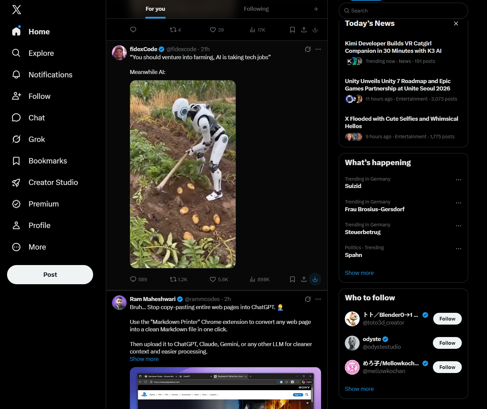

# X Downloader – Save Button

Save any video or GIF from **X (formerly Twitter)** with a single click. This lightweight Chrome extension drops a clean, native-looking **Save** button right into each post's action bar — no copy-pasting links, no sketchy third-party sites, no ads.

> **Scroll, spot a video, grab it in one click.** The **Save** button lives right next to Share in every post's action bar — no extra websites, no pasting links, no ads.

---

## ✨ Features

- **One-click downloads** — the Save button sits right next to Reply, Repost, Like, and Share.
- **Videos *and* GIFs** — grabs the highest-bitrate MP4 available; GIFs save as MP4 too.
- **Only where it matters** — the button shows up only on posts that actually have a video or GIF.
- **Native look** — matches X's own action buttons and turns blue on hover.
- **Clear feedback** — a green flash means the download kicked off; a red flash means the link couldn't be found (just refresh).
- **Tidy filenames** — files are saved as `x_<author>_<tweetID>.mp4` (GIFs get a `_gif` suffix).
- **Private by design** — everything runs locally in your browser. No tracking, no accounts, no external servers beyond X's own media CDN.
- **Featherweight** — Manifest V3, plain JavaScript, zero frameworks, zero bloat.

---

## 🚀 Installation (Load Unpacked)

This extension isn't on the Chrome Web Store yet, so you'll load it manually. Takes about 30 seconds.

1. **Grab the code** — click the green **Code** button above → **Download ZIP**, then unzip it. (Or `git clone` this repo if that's more your speed.)
2. Open your browser and go to `chrome://extensions`.
3. Turn on **Developer mode** (toggle in the top-right corner).
4. Click **Load unpacked** and select the project folder — the one with `manifest.json` in it.
5. Head over to [x.com](https://x.com) and refresh the tab. You're all set.

> Works in any Chromium-based browser — **Chrome, Edge, Brave, Opera, Arc**, and friends.

---

## 🎬 How to Use

1. Scroll to any post that has a video or GIF.
2. In the action bar beneath the post, you'll spot the **Save** button just to the right of Share.
3. Click it. Done — the file drops straight into your **Downloads** folder.

| Feedback | Meaning |
|----------|---------|
| 🟢 Green flash | Download started |
| 🔴 Red flash | Couldn't grab the link — refresh the page and try again |

Want to hide the button? Click the extension's icon in your toolbar and flip the **Save button** switch off.

---

## ⚙️ Settings

Click the extension icon in the Chrome toolbar to open the popup:

- **Save button** — show or hide the download button (on by default).

---

## 🔒 Privacy & Permissions

This extension collects **nothing** — no analytics, no telemetry, no accounts. Here's exactly why it asks for each permission:

| Permission | Why it's needed |
|------------|-----------------|
| `downloads` | To save the file to your computer |
| `storage` | To remember your on/off setting |
| `video.twimg.com` | X's media server — used only to fetch the file you clicked |
| `cdn.syndication.twimg.com` | X's public endpoint — a fallback for resolving the video link |

---

## 🛠 How It Works

X streams most videos through **MediaSource**, so the `<video>` tag only holds a `blob:` URL you can't save directly. To get around that, the extension listens to X's own **GraphQL API** responses and pulls out the direct MP4 link (always the highest bitrate). GIFs already expose a direct link in their `<source>`. When you hit Save, the background service worker downloads the file via `chrome.downloads`. If the API interception comes up empty, it falls back to X's public **syndication** endpoint using the tweet ID.

The extension never rebuilds X's DOM — it just injects one button anchored to stable `data-testid` hooks, so it stays completely out of React's way.

---

## 📁 Project Structure

| File | Role |
|------|------|
| `manifest.json` | MV3 config — permissions and content scripts |
| `interceptor.js` | MAIN world — pulls MP4 links out of X's API |
| `content.js` | Isolated world — injects the button and handles clicks |
| `content.css` | Button styling (`.xvd-btn`) |
| `background.js` | Service worker — `chrome.downloads` + syndication fallback |
| `popup.html` · `popup.js` · `popup.css` | Toolbar popup with the on/off toggle |

---

## ❓ Troubleshooting

- **No button on a video post?** Refresh the tab — the extension picks up the video link from the API as the page loads.
- **Red flash?** The link wasn't ready yet. Refresh and click again.
- **Button missing or misplaced after an X update?** X tweaks its markup from time to time. Open an issue and the selectors will get patched.

---

## ⚠️ Disclaimer

For **personal use only**. Please respect creators' rights and X's Terms of Service — only download content you have the right to save.
